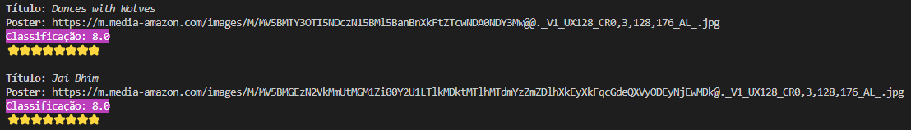

# Alura-Stickers

Esse projeto é um desafio realizado durante a imersão java_ da Alura, onde foi implementada uma aplicação java que consome a [API IMDB](https://imdb-api.com/) e gera figurinhas para Whatsapp.

## Tecnologia utilizada
1. **Java 17**

## Deafios a serem desenvolvidos

### Aula 01
- [x] Consumir o endpoint de filmes mais populares da API do IMDB. Procure também, na documentação da API do IMDB, o endpoint que retorna as melhores séries e o que retorna as séries mais populares.
- [x] Usar sua criatividade para deixar a saída dos dados mais bonitinha: usar emojis com código UTF-8, mostrar a nota do filme como estrelinhas, decorar o terminal com cores, negrito e itálico usando códigos ANSI, e mais!

- [x] Colocar a chave da API do IMDB em algum lugar fora do código como um arquivo de configuração (p. ex, um arquivo .properties) ou uma variável de ambiente.
- [ ] Mudar o JsonParser para usar uma biblioteca de parsing de JSON como Jackson ou GSON
- [ ] Desafio supremo: criar alguma maneira para você dar uma avaliação ao filme, puxando de algum arquivo de configuração OU pedindo a avaliação para o usuário digitar no terminal.

### Aula 02
- [x] Ler a documentação da classe abstrata InputStream.
- [x] Centralizar o texto na figurinha.
- [ ] Fazer um pacote no Whatsapp e/ou Telegram com as suas próprias figurinhas!
- [x] Criar diretório de saída das imagens, se ainda não existir.
- [x] Colocar outra fonte como a Comic Sans ou a Impact, a fonte usada em memes.
- [ ] Colocar uma imagem de você que está fazendo esse curso sorrindo, fazendo joinha!
- [ ] Colocar contorno (outline) no texto da imagem. (Verificando problema com a coloração preta na borda)
- [ ] Tratar as imagens retornadas pela API do IMDB para pegar uma imagem maior ao invés dos thumbnails. Opções: pegar a URL da imagem e remover o trecho mostrado durante a aula ou consumir o endpoint de posters da API do IMDB (mais trabalhoso), tratando o JSON retornado. (Aguardando IMDB voltar ao ar)
- [ ] Fazer com que o texto da figurinha seja personalizado de acordo com as classificações do IMDB.
- [ ] Desafio supremo: usar alguma biblioteca de manipulação de imagens como OpenCV pra extrair imagem principal e contorná-la.