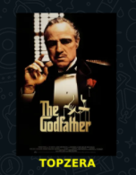

# Alura-Stickers v2

Esse projeto é um desafio realizado durante a imersão java_ da Alura, onde foi implementada uma aplicação java que consome a [API IMDB](https://imdb-api.com/) e gera figurinhas para Whatsapp.

## Tecnologia utilizada
1. **Java 17**

## Deafios a serem desenvolvidos

- [x] Ler a documentação da classe abstrata InputStream.
- [x] Centralizar o texto na figurinha.
- [ ] Fazer um pacote no Whatsapp e/ou Telegram com as suas próprias figurinhas!
- [x] Criar diretório de saída das imagens, se ainda não existir.
- [x] Colocar outra fonte como a Comic Sans ou a Impact, a fonte usada em memes.
- [ ] Colocar uma imagem de você que está fazendo esse curso sorrindo, fazendo joinha!
- [ ] Colocar contorno (outline) no texto da imagem. (Verificando problema com a coloração preta na borda)
- [x] Tratar as imagens retornadas pela API do IMDB para pegar uma imagem maior ao invés dos thumbnails. Opções: pegar a URL da imagem e remover o trecho mostrado durante a aula ou consumir o endpoint de posters da API do IMDB (mais trabalhoso), tratando o JSON retornado.
- [ ] Fazer com que o texto da figurinha seja personalizado de acordo com as classificações do IMDB.
- [ ] Desafio supremo: usar alguma biblioteca de manipulação de imagens como OpenCV pra extrair imagem principal e contorná-la.